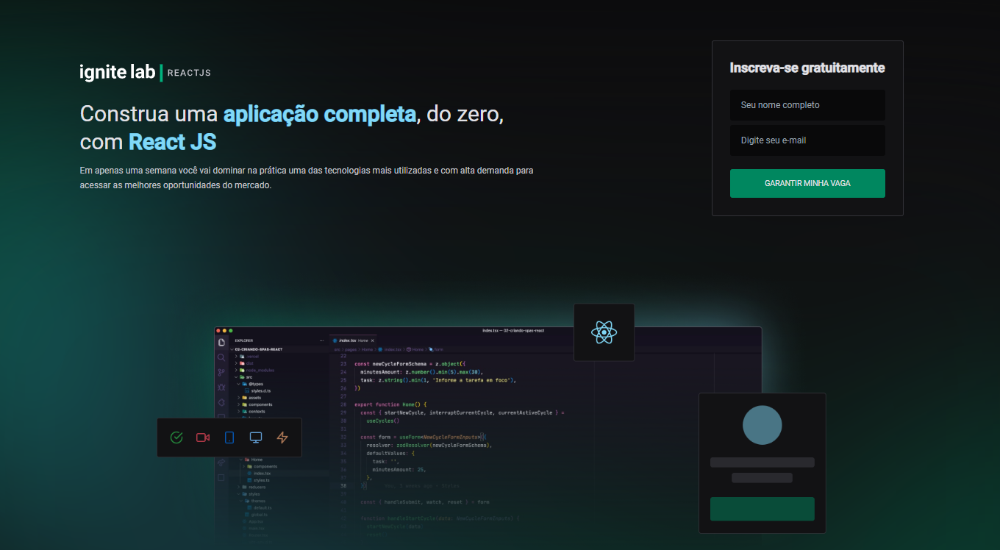

# Ignite-lab :rocket:

<Strong>Projeto desenvolvido durante o ignitelab da rocketseat afim de se especializar em react.</Strong>

### Objetivo :triangular_flag_on_post:
O intúito desse projeto era desenvolver uma plataforma de eventos, onde os videos seriam disponibilizados de acordo com a data.
Dentre as funcionalidades do projetos temos o cadastro de novas aulas e professores, bem como capturar nome e email dos usuarios que se cadastrarem. Os usuarios podem apenas se cadastrar e navegar pelas aulas.
O projeto foi desenvolvido em uma semana utilizando react, graphql, apollo-client, graphcms, tailwindcss, entre outras tecnologias.

#### Ignite-lab :fire:

O evento igniteLab é um evento promovido pela rocketseat a fim de se aperfeiçoar no desenvolvimento web. A principal tecnologia utilizada foi o React.
O evento ocorre durante uma semana.

## Skills 🛠 

![react][react] ![graphql][graphql] ![apollo client][apollo] ![tailwind css][tailwind] ![vite][vite]

## Layout :straight_ruler: :black_nib:

### Mobile :iphone:

  
  

### WEB :computer:

[react]: https://img.shields.io/badge/react-1E4174?style=for-the-badge&logo=react&logoColor=white
[graphql]: https://img.shields.io/badge/graphql-1E4174?style=for-the-badge&logo=graphql&logoColor=white
[apollo]: https://img.shields.io/badge/apollo%20client-1E4174?style=for-the-badge&logo=apollographql&logoColor=white
[tailwind]: https://img.shields.io/badge/tailwind%20css-1E4174?style=for-the-badge&logo=tailwindcss&logoColor=white
[vite]: https://img.shields.io/badge/vite-1E4174?style=for-the-badge&logo=vite&logoColor=white
